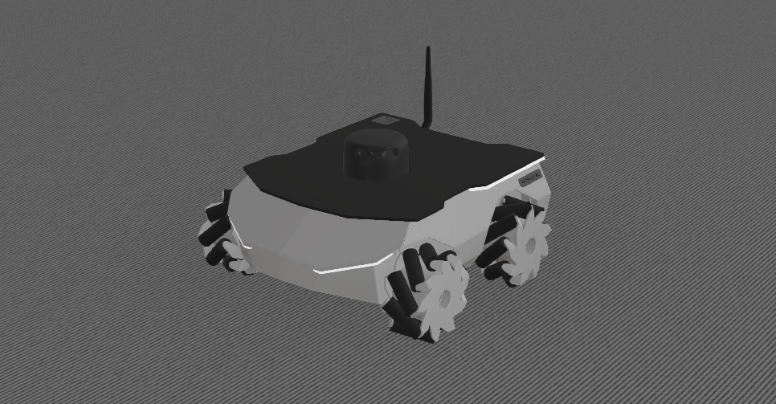

# webots-docker

[](https://github.com/husarion/webots-docker/actions/workflows/ros-docker-image.yaml)

[](https://github.com/husarion/webots-docker/actions/workflows/vulcanexus-docker-image.yaml)

Dockerized ROSbot 2R and ROSbot XL simulation in webots built for ROS2 Humble distro.


## Docker image usage

Available tags: `humble`.

### Pulling docker image

```bash
docker pull husarion/webots:humble
```

### Adding non-network local connections to access control list

```
xhost local:docker
```

### Running docker image

Select the ROSbot:
```bash
export ROBOT_NAME=rosbot # or rosbot_xl
```

Without GPU:
```bash
docker run --rm -it \
-v /tmp/.X11-unix:/tmp/.X11-unix:rw \
-e DISPLAY -e LIBGL_ALWAYS_SOFTWARE=1 \
-e DDS_CONFIG=DEFAULT -e RMW_IMPLEMENTATION=rmw_fastrtps_cpp \
husarion/webots:humble \
ros2 launch webots_ros2_husarion ${ROBOT_NAME}_launch.py
```

With GPU:
```bash
docker run --rm -it \
--runtime=nvidia \
-v /tmp/.X11-unix:/tmp/.X11-unix:rw \
-e NVIDIA_VISIBLE_DEVICES=all \
-e NVIDIA_DRIVER_CAPABILITIES=all \
-e DISPLAY \
-e DDS_CONFIG=DEFAULT -e RMW_IMPLEMENTATION=rmw_fastrtps_cpp \
husarion/webots:humble \
ros2 launch webots_ros2_husarion ${ROBOT_NAME}_launch.py
```



### Running demo with `docker compose`

Go to [demo/](demo/) folder and read [demo/README.md](demo/README.md).
